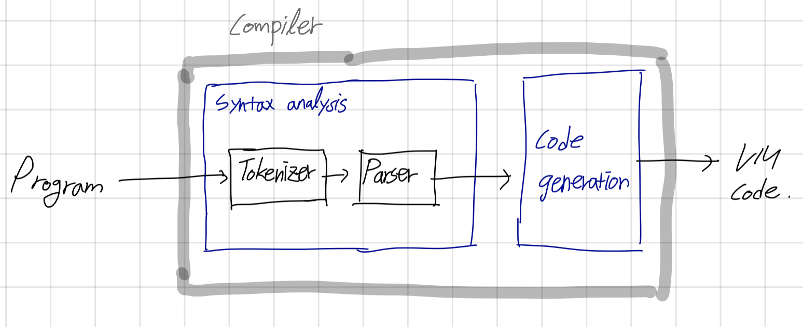

# CH10. Compiler - Syntax Analysis

컴파일은 크게 두 단계로 나뉜다.

- **Syntax Analysis** (구문 분석)
- **Code Generation** (코드 생성)

이번 장(10장)에서는 Syntax Analysis (구문 분석)을 다룬다. 구문 분석은 크게 두 가지 전략이 있다. 첫 번째로는 **top-down** (하향식), 두 번째는 **bottom-up** (상향식).

> **Warning**
>
> bottom-up 방식이 더 진보된 알고리즘인데, 더 정교한 이론을 알아야 하기 때문에 여기서는 top-down 방식을 설명하고 있다.
>
> 그리고 formal language theory (형식 언어 이론) 설명은 거의 대부분 생략되었다.
>
> 구문 분석기는 독립적인 프로그램은 아니며, 밑바닥부터 구현하는 경우는 드물다. 보통 토큰화 모듈이나 구문 분석기를 만들 때, Lex (어휘 분석 도구) 와 Yacc 과 같은 컴파일러 생성기 도구들을 이용한다. 이 도구들은 Context Free Grammer (CFG, 문맥 자유 문법)를 입력하면, 그 문법으로 작성된 프로그램을 토큰화하고 분석하는 문법 분석 코드를 출력한다. 그리고 컴파일 조건에 맞춰 생성 코드를 수정할 수 있다.

컴파일 과정은 개념적으로 두 개로 나뉜다. 프로그램의 **Syntax** (구문)을 이해하고, 그 구문을 통해 프로그램의 **Semantics** (의미)를 찾는 과정이다.

이 장에서는 syntax analysis 를 만들기 위해 필요한 최소한의 개념들, **lexical analysis**, **context-free grammar**, **parse tree**, **recursive descent algorithm** 을 간단하게 알아본다.

## 1. 배경

위에서 컴파일러는 크게 syntax analysis 와 code generation 의 두 모듈로 구성된다고 말했다. 보통 syntax analysis 에서 두 모듈로 나누어 진다.

- **Tokenizer** : 입력 문자들을 언어 기본 요소들로 분류
- **Parser** : Tokenizing 결과로 나온 언어 기본 요소 스트림을 언어의 구문 규칙에 맞춤

Syntax analysis 는 **프로그램의 구조를 해석**하는 역할을 한다. 사람이 프로그램 구조를 인지하는 것처럼.

formal language 에 한정하면, 구문 구조를 정확하게 정의할 수 있다. 프로그래밍 언어는 보통 context-free grammar 규칙들로 기술된다. 따라서 **프로그램을 이해(or 분석 parse)한다는 것**은\*\* **프로그램의 텍스트와 분법 규칙 사이에 정확한 대응 관계를 결정**한다는 뜻이다.

그렇기 하기 위해서는 우선 프로그램의 텍스트를 토큰들로 구성된 리스트로 재구성해야된다.

### 1.1 어휘 분석

프로그램의 가장 단순한 구문 요소는 텍스트 파일의 문자열이다. 구문 분석의 첫 단계는 공백과 주석 무시, 토큰들로 분류를 한다. 이 과정을 보통 scanning, tokenizing, lexical analysis 라고 한다.

### 1.2 문법

### 1.3 구문 분석
